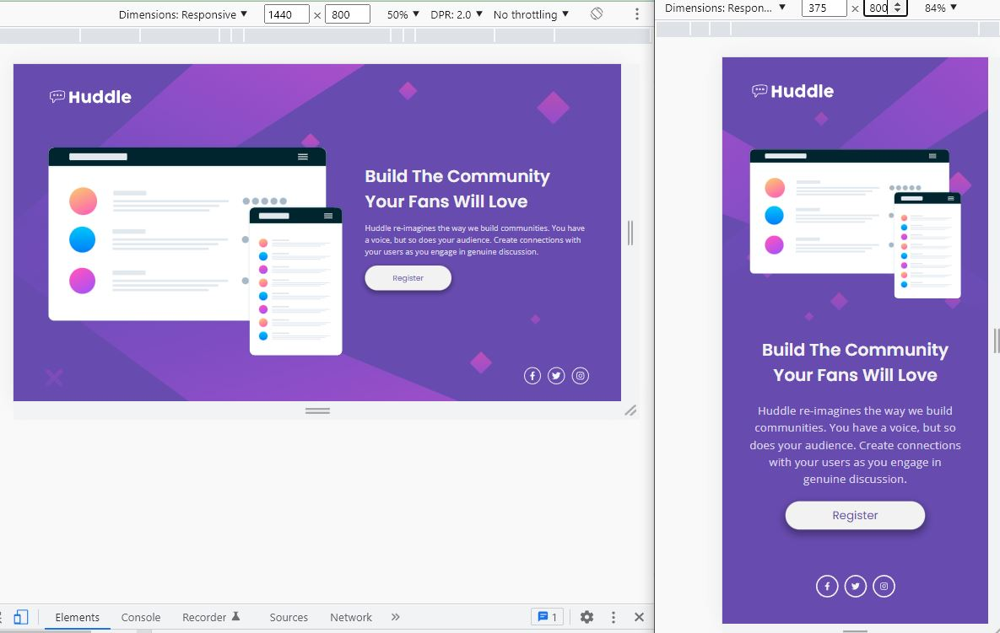

# Frontend Mentor - Huddle landing page with single introductory section solution

This is a solution to the [Huddle landing page with single introductory section challenge on Frontend Mentor](https://www.frontendmentor.io/challenges/huddle-landing-page-with-a-single-introductory-section-B_2Wvxgi0).

## Table of contents

- [Overview](#overview)
  - [The challenge](#the-challenge)
  - [Screenshot](#screenshot)
  - [Links](#links)
- [My process](#my-process)
  - [Workflow](#workflow)
  - [Built with](#built-with)
  - [What I learned](#what-i-learned)
  - [Continued development](#continued-development)
  - [Useful resources](#useful-resources)
- [Author](#author)
- [Acknowledgments](#acknowledgments)

## Overview

### The challenge

Users should be able to:

- View the optimal layout for the page depending on their device's screen size
- See hover states for all interactive elements on the page

### Screenshot

### Links

- Solution: [frontendmentor.io](https://www.frontendmentor.io/solutions/huddle-landing-page-with-single-introductory-section-uRvfyFMMj3)
- Live Site: [github.io](https://siavhnz.github.io/frontendmentor/9.huddle-landing-page-with-single-introductory-section/index.html)

## My process

### Workflow

 - Setting up workflow
 - Identifing elements and creating html skeleton based on `./assets/design/*`
 - Setting up CSS preflight (Prepare reset css, Add Google fonts, Identify CSS custom properties)
 - Working on mobile design
 - Working on Desktop design
 - Write README.md
 - publish on github.io | github.com | frontendmentor.io

### Built with

- Semantic HTML5 markup
- CSS custom properties
- Mobile-first workflow
- Flexbox
- CSS Grid

### What I learned

I learned some tricks:
  - How to accessible svg icons for screen readers
  - How to change the color of an svg element
  - How to keep the footer at the bottom

### Continued development

I need more practice on CSS Grid layout

### Useful resources

- [Accessible SVG Icons - css-tricks](https://css-tricks.com/accessible-svg-icons/)

- [Change the color of an svg element - stackoverflow](https://stackoverflow.com/a/65147574)

- [Keep the footer at the bottom](https://moderncss.dev/keep-the-footer-at-the-bottom-flexbox-vs-grid/)

## Author

Frontend Mentor - [@siavhnz](https://www.frontendmentor.io/profile/siavhnz)

## Acknowledgments

[Frontendmentor.io](https://www.frontendmentor.io/challenges) - for their Excitement challenges  

[Perfect Pixel](https://chrome.google.com/webstore/detail/perfectpixel-by-welldonec/dkaagdgjmgdmbnecmcefdhjekcoceebi?hl=en) - for such a great extension
